# Everything You Wanted to Know about Serving Language Models on GCP but Were Afraid to Ask

This blog aims to serve as a reference for deploying BERT and Transformers model specifically on GCP. 
We explored three serverless options, namely Cloud Functions, App Engine (standard environment and flexible environment) 
and Cloud Run for deploying the language models.

From the study, the following conclusions can be drawn:

  - Cloud Run produced the most predictable response time.
  - While Cloud Functions and App Engine deployments responded very quickly for a relatively small model, 
    they were outperformed by Cloud Run as the model size increased.
  - From the throughput tests, we can see the autoscaling ability helped the Cloud Functions to cope with the increasing 
    number of requests very effectively.
  - When the computation capacities of Cloud Run and App Engine deployments increased, we saw an increase in the 
    performance and throughput. However, the improvement did not follow a linear relationship. The reason might be due to 
    the fact that both of the hosting environments only provide CPU which does not scale well with parallel data computations.

## Table of Content

1. [Introduction](#0)
1. [Zero-shot Learning Using Pre-Trained Models](#1)
1. [Our Approach to the Survey](#2)
1. [Deployment Examples](#3)
1. [Performance and Reliability Tests](#4)
1. [Conclusions](#5)

## Introduction <a id="0"></a>

In the past decade, we have seen a surge in the development of machine learning models for helping machines to understand human languages.  Following the release of the Transformer model by Google, we have seen a wide range of attention-oriented language models being trained and used for  various Natural Language Processing (NLP) tasks. These models are pre-trained by technology vendors, such as [T5(Google)](https://ai.googleblog.com/2020/02/exploring-transfer-learning-with-t5.html), [Turing-NLG (Microsoft)](https://www.microsoft.com/en-us/research/blog/turing-nlg-a-17-billion-parameter-language-model-by-microsoft/), [GPT (OpenAI)](https://openai.com/blog/better-language-models/), [BERT-mtl (IBM Watson NLP)](https://github.com/IBM/superglue-mtl), [RoBERTa (Facebook)](https://ai.facebook.com/blog/roberta-an-optimized-method-for-pretraining-self-supervised-nlp-systems/) amongst others. After being acquired by natural language practitioners, pre-trained models have then been further fine-tuned with zero- or few-shot learning to be specialised in particular application domains, such as analysing or summarising documents in finance or insurance. 

However, to make a pre-trained model be able to serve its potential target users, the model needs to be productionised and deployed. Cloud computing is one compelling option for adoption as a production model for machine learning, and offers a number of approaches that can be used to provide service within a natural language processing application using a language model. In this blog, we examine several fully-managed options provided by Google Cloud Platform (GCP). These deployment-as-a-service offers provided by GCP allow a machine learning provider to easily configure, deploy and monitor their models through the GCP console, programmatically from a python code or with command-line tools. 

There are four objectives we would like to convey to the readers of this blog:

1.	This blog can be served as a simple guideline for quickly deploying and experimenting fine-tuned or pre-trained language models on GCP. We provide simple deployment configuration files, Dockerfiles and sample zero-shot learning code examples to illustrate the steps required to deploy language models to GCP.  
2.	We reviewed the performance and reliability of serving the models on GCP. In particular, for each of the deployment services, we provide experimental results on: 
    - the latency, i.e., the time taken for making a request and returning a response
    - the throughput, i.e., the rate at which the services can handle requests
    - the reliability, i.e., the rate of failed responses in stress testing
3.	We reviewed and listed pricing and quota information on each of the examined deployment options. 
4.	We demonstrated the options users have on monitoring and controlling the operations of the models.

Before examining each of the deployment options on GCP, we would like to briefly provide some background on NLP using machine learning.  

## Zero-shot Learning Using Pre-Trained Models <a id="1"></a>

As mentioned earlier in the blog, many studies in academics and technology vendors have been focused on training, tuning and sharing of language models. Google has been the leading player in designing and developing model architectures, as well as training and sharing a few important language models including:

- Word2vec, original paper: [Efficient Estimation of Word Representations in Vector Space](https://arxiv.org/abs/1301.3781)
- Transformers, original paper:  [Attention Is All You Need](https://arxiv.org/abs/1706.03762)
- BERT, original paper: [BERT: Pre-training of Deep Bidirectional Transformers for Language Understanding](https://arxiv.org/abs/1810.04805)
- T5, original paper: [Exploring the Limits of Transfer Learning with a Unified Text-to-Text Transformer](https://arxiv.org/abs/1910.10683)

We have seen a significant increase in the size of most pre-trained language models, in terms of the number of parameters that constitute them, and the computation resources needed to deploy the models as a service. The latest version of the GPT model has 175 billion parameters, and storing a single copy of it requires 700GB of hard disk space. The largest [T5.1.1.XXL model](https://github.com/google-research/text-to-text-transfer-transformer) developed by Google has 11 billion parameters. In early 2021, Google released its 1.6 trillion parameter model, Switch Transformers ([original paper](https://arxiv.org/abs/2101.03961)). Despite its size, it can achieve up to four times speedup over the T5.XXL model.  

At the time of writing this blog, there has been little discussion, review and comparison in the literature focused on the serving of language models on Google Cloud. In this blog, we first illustrate the steps required to deploy language models to several fully-managed cloud environments available in GCP. Furthermore, the next important question is how do the performance and reliability change with different model architecture (recurrent networks, transformers or encoder-only), programming libraries (TensorFlow or PyTorch) and the model size?   

For illustration purposes, we will deploy pre-trained PyTorch version BERT models (Distil and Base) and Tensorflow versions of [T5 models](https://github.com/google-research/text-to-text-transfer-transformer/blob/master/released_checkpoints.md) (Small with ~77 million parameters and Base ~250 million parameters) in this blog. The BERT models are encoder-only, attention-oriented models, whereas T5 was designed using the full transformer architecture (i.e., 14 layer groups of encoder and decoder). We deploy and experiment with the BERT models for providing text classification services, where the deployed T5 models will provide text summarisation services.  


## Our Approach to the Survey <a id="2"></a>

The aim of this blog is not to advocate a particular deployment option for a specific language model, but to serve as a reference for selecting a deployment option for any application domains, and for implementing requirements on the quality of service. 

We examined three hosting services provided by GCP:
1.	Cloud Functions
1.	Cloud Run
1.	App Engine (Standard Environment and Flexible Environment)

Cloud Functions is a serverless execution environment for building and connecting cloud services. ([source](https://cloud.google.com/functions/docs/concepts/overview)). 
The typical use cases of Cloud Functions are real-time data processing, webhooks, lightweight APIs, mobile backend and IoT, etc.
Cloud Run is container-based, and it enables users to run stateless containers that are invocable via web requests or Pub/Sub events. 
It can be applied to cases like building websites, REST APIs backends, back-office administration, light-weight data processing and automation tasks.
App Engine is a fully-managed, serverless platform for developing and hosting web applications at scale.
The user can run an App Engine application in two environments, the standard environment and the flexible environment. 
While the standard environment is suitable for applications that need to deal with rapid scaling and are intended to run 
for free or at very low cost, the flexible environment is designed for applications that receive consistent traffic, 
experience regular traffic fluctuations, or meet the parameters for scaling up and down gradually ([source](https://cloud.google.com/appengine/docs/the-appengine-environments)).
All the hosting services are serverless and fully-managed so that users do not need to worry about provisioning the infrastructure. 
Besides, they can automatically scale based on the demand. 

A Docker container is the unit of deployment for all the hosting options above, with different levels of configuration required. For App Engine and Cloud Run, we can include extract application artefacts in the container when building the container locally before pushing to the container registry. For example, users may want to package a pre-trained model of any size in a sub-directory with the application code. For Cloud Function, we can include model files. However, this will be limited by the maximum deployment size of 100 MB for a single function.  

The methodologies we used to evaluate the performance and reliability are:
1.	We selected some permutations of different combinations of:
  - Number of CPUs in any of [1, 2, 4, 6, 8, 16],
  - Size of memory in any of [1GB, 2GB, 4GB, 8GB, 16GB],
  - Number of servicing instances (either manually fixed to 3 instances or set 3 instances as maximum for GCP to tune during runtime). 
2.	We ran 10 model prediction requests. From the responses received, we recorded the latency.
3.	By leveraging multithreading, we test the concurrency of request handling by the hosting options and the reliability.

In this blog, we tested the deployment options with fixed NLP tasks (text classification for BERT and text summarisation for T5). We anticipate the performance and reliability of a hosting service will predominantly depend on model architecture and size, as well as the following aspects of requests:
  - Type – the specific type NLP task, e.g., text classification and summarisation.
  - Size – the size of the text to be classified (and the number of target labels to be considered), or summarised.
  - Rate – number of requests in a finite period.

#### AI Platform & Vertex AI 

We excluded the exploration on AI Platform & Vertex AI for the following reasons: 
1. At the time of writing this blog, many functions of AI Platform are still at Beta or Preview stage, meaning that there are challenges with using it for production deployment, especially with regard to:  
- [Serving PyTorch predictions with a custom container](https://cloud.google.com/ai-platform/prediction/docs/getting-started-pytorch-container) 
- [Viewing audit logs](https://cloud.google.com/ai-platform/prediction/docs/audit-logs)
2. There are still some known issues ([one example](https://github.com/huggingface/transformers/issues/9926)) on its support of PyTorch BERT models.
3. All online prediction machine time only supports TensorFlow, XGBoost and Scikit-learn, not PyTorch yet. 

As this post was prepared, GCP announced that AI Platform has been extended and rebranded as the [Vertex AI](https://cloud.google.com/vertex-ai) platform, and so we will evaluate that in a future post.

## Deployment Examples <a id="3"></a>

In this section, we examined the three serverless options on GCP for model deployment: Cloud Functions, Cloud Run and App Engine. 
We will give examples for each option regarding how to deploy the model, configure the deployment 
and make requests against the deployed services.

### Cloud Functions

To deploy a Cloud Function, we need at least the following two files:
- `main.py` - a Python script containing the function for execution
- `requirements.txt` - a list of the required dependencies for Python programme

Below is the [main.py](cloudfunction/sentbert/main.py) file we used to deploy the Sentence-BERT model on Cloud Functions.  

```python
def run_zeroshot_sentbert(request):
    import os
    from transformers import AutoTokenizer, AutoModel
    from torch.nn import functional as F
    from sklearn.metrics.pairwise import cosine_similarity
    import torch
    
    data = request.get_json()
    print(data)
    
    ################# run zeroshot ############

    response = ''

    sentence = data['sentence']
    labels = data['labels'].split(',')
    try:
        try:
            print('retrieve saved model')
            tokenizer = AutoTokenizer.from_pretrained('/tmp/sentence-bert_tokenizers')
            model = AutoModel.from_pretrained('/tmp/sentence-bert_model')
        except:
            print('loading and save models')
            tokenizer = AutoTokenizer.from_pretrained('deepset/sentence_bert')
            model = AutoModel.from_pretrained('deepset/sentence_bert')
            tokenizer.save_pretrained('/tmp/sentence-bert_tokenizers')
            model.save_pretrained('/tmp/sentence-bert_model')

        print('Tokenizing')
        # Encode and tokenize the sentence and labels
        inputs = tokenizer.batch_encode_plus([sentence] + labels,
                                             return_tensors='pt',
                                             pad_to_max_length=True)
        input_ids = inputs['input_ids']
        attention_mask = inputs['attention_mask']
        print('Generating Embeddings')
        # Inference the embedding using the pre-trained model
        output = model(input_ids, attention_mask=attention_mask)[0]
        sentence_emb = output[:1].mean(dim=1)
        label_emb = output[1:].mean(dim=1)


        print('Similarity Comparison')
        similarities = F.cosine_similarity(sentence_emb, label_emb)
        closest = similarities.argsort(descending=True)
        print('Assigned Labels: ')
        for ind in closest:
            response += f'{labels[ind]} \t similarity: {round(similarities[ind].item(), 2)}\n'
        del output,model,sentence_emb,label_emb,similarities,closest,inputs,input_ids,attention_mask
        torch.cuda.empty_cache()
    except Exception as e:
        response = 'Something went wrong'
        print(e)

    return response
```

Notice that the inner `try` and `except` block will allow the main function `run_zeroshot_sentbert` to either retrieve a locally saved model (this case in `/tmp/`) or if a saved model is not available, we download a pre-trained model from the [HuggingFace model repository](https://huggingface.co/models).   

```
        try:
            print('retrieve saved model')
            tokenizer = AutoTokenizer.from_pretrained('/tmp/sentence-bert_tokenizers')
            model = AutoModel.from_pretrained('/tmp/sentence-bert_model')
        except:
            print('loading and save models')
            tokenizer = AutoTokenizer.from_pretrained('deepset/sentence_bert')
            model = AutoModel.from_pretrained('deepset/sentence_bert')
            tokenizer.save_pretrained('/tmp/sentence-bert_tokenizers')
            model.save_pretrained('/tmp/sentence-bert_model')
```

We use similar code when experimenting with the other deployment options. 


We specify the dependencies in the [requirements.txt](cloudfunction/sentbert/requirements.txt)
```txt
torch
scikit-learn
```

To deploy the Cloud Function, we can use Cloud Console or `gcloud functions deploy` command lines and 
in this study, we chose the Cloud Console for deployment. 

First, from the navigation menu, click **Cloud Functions** to go to the Cloud Functions Overview page and then click 
**CREATE FUNCTION**. 
Next, provide the basic information of the function as shown in the screenshot below which includes the name, region, 
trigger type, authentication. Then, click **SAVE** to continue.

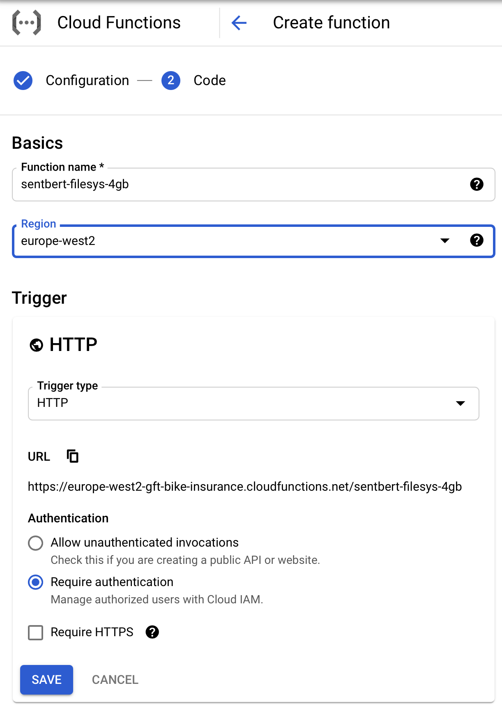

_Figure 1. Provide the basic information of Cloud Functions_ 

We then need to click **RUNTIME, BUILD AND CONNECTION SETTINGS** to configure the runtime. Note that we set the memory 
to be 4GB and Timeout to 500s to meet the requirement for serving the Sentence-BERT model. 
Click **NEXT** to continue.

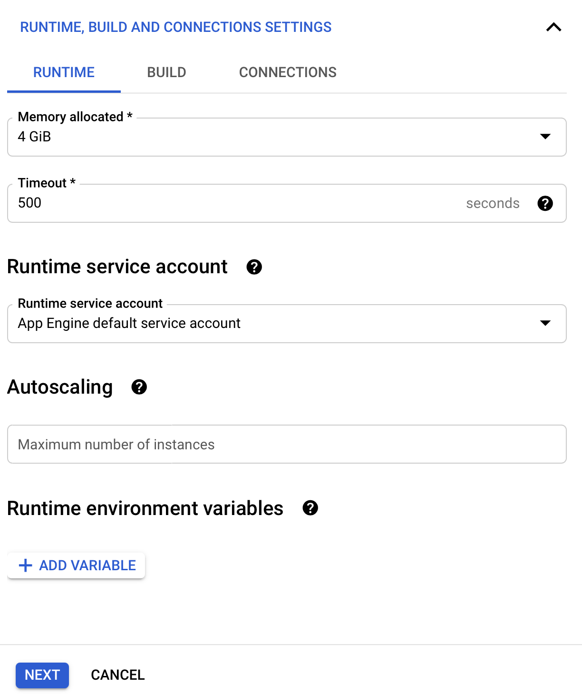

_Figure 2. Set the runtime (memory, timeout) for Cloud Functions_ 

This is now the source code editing page where we set the runtime as Python3.8. 
Copy the [main.py](cloudfunction/sentbert/main.py) and [requirements.txt](cloudfunction/sentbert/requirements.txt) 
using the inline editor. 
Then, set the entry point (execution function) to be `run_zeroshot_sentbert`. 
Finally, click **DEPLOY** to deploy the Cloud Function. It takes several minutes for the function to be deployed.

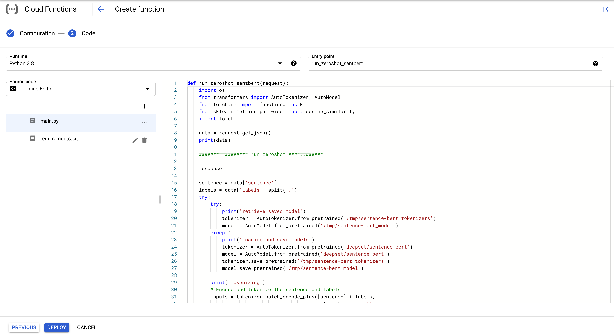

_Figure 3. Code editing interface for Cloud Functions_ 

Once the deployment completes, the Cloud Function will show on the overview page with a green tick box as below:

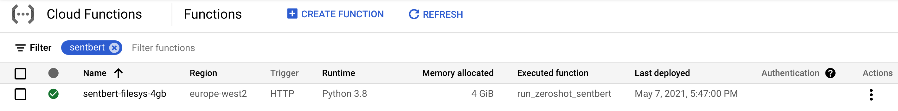

_Figure 4. Successfully deployed Cloud Functions on the overview page_ 

There is a trigger URL that is used to make requests against the Cloud Function. 
It can be found under the TRIGGER tab of function details by clicking the deployed function. 
With the endpoint URL, we can use the requests package to make requests together with the data in JSON format. 
Since we set the Cloud Function to accept authenticated requests only, we need to provide the token in the header, and 
this holds true for the other two options we explored. 

Below is an example showing how we make requests to the deployed Cloud Function.

```python
import subprocess
import json
import requests
cf_sentbert='https://europe-west2-gft-bike-insurance.cloudfunctions.net/sentbert-filesys-4gb'
data_bert = {"sentence": "I am not unhappy about the service you provided.",
             "labels": "happy,unhappy,neutral"}
output = subprocess.check_output("echo $(gcloud auth print-identity-token)", shell=True, text=True)
access_token = "Bearer " + output[:-1]
headers = {'Authorization': access_token}
response = requests.post(cf_sentbert, 
                         headers=headers, 
                         json=data_bert)
print(response.text)
```

We challenge the BERT model to rank with a degree of similarity from the set of sentiment labels `{'happy','unhappy','neutral'}` to the sentence "I am not unhappy about the service you provided." With the latest version of the [deepset sentence BERT model](https://huggingface.co/deepset/sentence_bert) at the time of writing this blog, we expect to receive a response being printed out in the same order order as: 

```
happy 	 similarity: 0.65
neutral 	 similarity: 0.35
unhappy 	 similarity: 0.07 
```

Although the test sentence contains the work `unhappy`, BERT is able to interpret it having a happy mood because it has the negation word `not` in front of `unhappy` (i.e., a double-negation expression). This example can demonstrate the effectiveness of applying an attention-based language model  in comparison to a statistical-based approach such as [TF-IDF](https://towardsdatascience.com/a-beginners-guide-to-text-classification-with-scikit-learn-632357e16f3a). 

### Cloud Run

To deploy the service zeroshot-t5, we need to have the following files: 
- `app.py` - a flask app for serving the model
- `Dockerfile` - for building Docker image according to specifics
- `requirements.txt` - lists the dependencies
- `service.yaml` - specifies the configuration of the deployment, e.g., number of instances, memory, etc

Follow these steps to deploy the model on Cloud Run:
1. Open the terminal and change the current working directory to the folder containing the above files.
1. Then, build a Docker image by running 
   `docker build -t gcr.io/gft-bike-insurance/zeroshot-t5:latest .`
1. After this, push the image into Google Container Registry by running 
   `docker push gcr.io/gft-bike-insurance/zeroshot-t5:latest`
1. The container can be deployed on Cloud Run using gcloud tool 
   `gcloud beta run services replace service.yaml --platform=managed --region=europe-west2` 
   with configurations defined in the yaml file. Here is the service.yaml, in which the name of service, CPU and memory allocations, link to the Docker image, etc 
   are defined.
   ```yaml
    apiVersion: serving.knative.dev/v1
    kind: Service
    metadata:
      name: zeroshot-t5
    spec:
      template:
        metadata:
          annotations:
            autoscaling.knative.dev/maxScale: '3'
        spec:
          containers:
          - image: gcr.io/gft-bike-insurance/zeroshot-t5:latest
            ports:
            - containerPort: 5000
            resources:
              limits:
                cpu: '2'
                memory: 4096Mi
          serviceAccountName: 704608691211-compute@developer.gserviceaccount.com
    ```
1. Finally, get the endpoint URL of the cloud run service 
   ('https://zeroshot-t5-apnir7ajvq-nw.a.run.app/run-zerohot-t5' in this case)
   
To make requests to the deployed Cloud Run service, use the following code as an example. Similar to calling a Cloud 
Functions service, we need to provide requests with the access token for authentication purpose, the data and endpoint URL.
```python
import subprocess
import json
import requests

cr_t5 = 'https://zeroshot-t5-apnir7ajvq-nw.a.run.app/run-zerohot-t5'
sentence = '''
summarize: The US has passed the peak on new coronavirus cases, President Donald Trump said and predicted that some states would reopen this month. 
The US has over 637,000 confirmed Covid-19 cases and over 30,826 deaths, the highest for any country in the world. 
At the daily White House coronavirus briefing on Wednesday, 
Trump said new guidelines to reopen the country would be announced on Thursday after he speaks to governors. 
We will be the comeback kids, all of us, he said. We want to get our country back. 
The Trump administration has previously fixed May 1 as a possible date to reopen the worlds largest economy, 
but the president said some states may be able to return to normalcy earlier than that.
'''
data_t5_small = {
  "sentence": sentence,
    "model_name": "t5-small"
  }

output = subprocess.check_output("echo $(gcloud auth print-identity-token)", shell=True, text=True)
access_token = "Bearer " + output[:-1]
headers = {'Authorization': access_token}

response = requests.post(cr_t5, 
                         headers=headers, 
                         json=data_t5_small)

print(response.text)
```

For this particular text summarisation challenge, we saw the `t5-small` responded with:

```
{ output:<pad> the US has over 637,000 confirmed Covid-19 cases and over 30,826 deaths. the president said new guidelines to reopen the country would be announced on tuesday.
}
```

### App Engine

To deploy service on App Engine, we need the following files:
- `main.py` - A flask app for serving the model
- `app.yaml` - App Engine application configuration file
- `requirements.txt` - A list of dependencies for the project

Here is the [app.yaml](appengine/t5-base-flex/app.yaml) file used for deploying T5 models using App Engine. 
Note that the `--timeout` flag in the entrypoint is set explicitly to 300s to overwrite the default 30s. 
Also, we can use`--workers` flag in the entrypoint field to configure the number of workers serving the application.

```yaml
runtime: python
env: flex
entrypoint: gunicorn -b :$PORT main:app --timeout 300
service: t5-base-flex

runtime_config:
  python_version: 3

manual_scaling:
  instances: 3
resources:
  cpu: 2
  memory_gb: 4
  disk_size_gb: 20
```

We can change the directory to the folder containing the yaml file and run `gcloud app deploy app.yaml` to deploy the App Engine service. 
Once the service is deployed on App Engine, a URL is assigned to the service, through which API calls can be made. 

Then, providing the access token and data in the requests, we can use the following code to make requests to the service:

```python
import subprocess
import json
import requests
gae_t5_base = 'https://t5-base-flex-dot-gft-bike-insurance.nw.r.appspot.com/run-zerohot-t5'
sentence = '''
summarize: The US has passed the peak on new coronavirus cases, President Donald Trump said and predicted that some states would reopen this month. 
The US has over 637,000 confirmed Covid-19 cases and over 30,826 deaths, the highest for any country in the world. 
At the daily White House coronavirus briefing on Wednesday, 
Trump said new guidelines to reopen the country would be announced on Thursday after he speaks to governors. 
We will be the comeback kids, all of us, he said. We want to get our country back. 
The Trump administration has previously fixed May 1 as a possible date to reopen the worlds largest economy, 
but the president said some states may be able to return to normalcy earlier than that.
'''
data_t5_base = {
  "sentence": sentence,
    "model_name": "t5-base"
  }

output = subprocess.check_output("echo $(gcloud auth print-identity-token)", shell=True, text=True)
access_token = "Bearer " + output[:-1]
headers = {'Authorization': access_token}

response = requests.post(gae_t5_base, 
                         headers=headers, 
                         json=data_t5_base)

print(response.text)
```


## Pricing 

According to [GCP documentation](https://cloud.google.com/functions/pricing), the price of using Cloud Functions is dependent on 
- how long your function runs 
- how many times it's invoked 
- how many resources you provision for the function and
- whether the function makes an outbound network request

For the details of App Engine pricing, readers are referred to [App Engine Pricing](https://cloud.google.com/appengine/pricing). 
Pricing is different for apps in the standard environment and the flexible environment. 
- The standard environment is billed mainly by instance hours and the network traffic. 
- The flexible environment deployments are billed against the core hours, GB hours, network traffics and the persistent disk size.

Besides, App Engine uses Cloud Build to build and deploy apps so costs will be incurred once the usage surpasses the free tier for Cloud Build.
Since the flexible environment has no free tier and an application always has a minimum number of running instances, 
it is therefore recommended by Google to use it for applications 
that serve traffic continuously to be cost-effective ([source](https://cloud.google.com/appengine/docs/python)).

Cloud Run is a fully managed service, and it charges only for the resources used (rounded up to the nearest 100 milliseconds). 
The charge depends on the following resources and all have a [free tier](https://cloud.google.com/run/pricing#tables):
- vCPU-second
- GB-second
- number of requests
- network traffics

It is worth noting that Cloud Run allows users to set the minimum instance to be 0 to save costs. 
Thus, when the application is not receiving requests, the service can be scaled down to 0.
However, the side effect is the so-called cold starts. When the application receives an initial request, 
it needs time to warm up, so the response time can be significantly longer.
Kelsey Hightower explained in the blog [Cloud Run min instances: Minimize your serverless cold starts](https://cloud.google.com/blog/products/serverless/cloud-run-adds-min-instances-feature-for-latency-sensitive-apps) why sometimes users 
want to set the minimum number of instance to be non-zero for latency-sensitive apps.

In Figure 5, we compare the price estimates for different services with different numbers of invocations per month. 
The following assumptions were made:
- For all products, we assume a need for 4GB memory and the execution time per request is 18000 ms. 
- For App Engine and Cloud Run, we assume 1 instance with 2 CPUs. 
- For Cloud Run, we looked at both cases with minimum instances of 0 and 1.

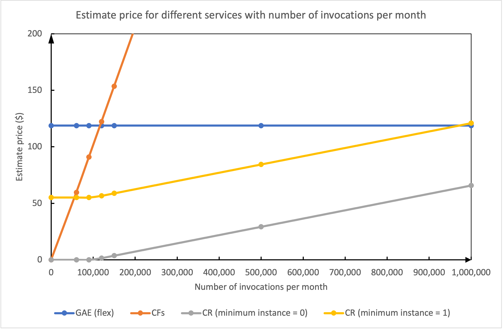

_Figure 5. Price estimates for different services with increasing number of invocations per month. Note: estimates for 
Cloud Run and App Engine are obtained using [Google Cloud Price Calculator](https://cloud.google.com/products/calculator) 
while the estimated price for Cloud Functions is calculated based on rules detailed at [the pricing page for Cloud Functions](https://cloud.google.com/functions/pricing)_

From the comparison, we can see that the cost of Cloud Functions grows linearly with the number of invocations per month, and 
when there are about 4,000 requests a day (~2.8 requests/minute), the cost of Cloud Functions becomes the highest. 
As expected, Cloud Run with zero minimum instance will be the most economical choice as it not only takes the advantage of free tier 
but also does not require any continuously running instances.
The reason behind the pattern of cost increase of Cloud Functions is that 
[Cloud Functions create as many instances as the concurrent requests](https://cloud.google.com/functions/docs/concepts/exec#auto-scaling_and_concurrency). 
On the other hand, Cloud Run utilises [one container instance(s) to handle up to 250 requests](https://cloud.google.com/run/docs/about-concurrency). 
The concurrency can be configured between 1 and 250, and it was set as 20 in this study. Therefore, leveraging Cloud Run for applications that need to handle a high degree of concurrent requests would be cheaper than Cloud Functions.

Comparing the App Engine flexible environment and Cloud Run with one minimum instance, we can see that Cloud Run still comes out cheaper than App Engine when 
there are less than about 950,000 requests/month (~32,000 requests/day). 
The main reason is Cloud Run enjoys free tier which includes 2 million free requests per month, 360,000 GiB-seconds free per month and 
180,000 vCPU-seconds free per month, while App Engine flexible environment does not come with free tier.

## Performance and Reliability Tests <a id="4"></a>

We carried out two types of performance comparisons on:
1. the performance across different service options.
2. the performances across different configurations of the same service option.

### Comparing the Three Options
We selected the deployments of T5 models using the three options: Cloud Functions, 
Cloud Run and App Engine (flexible environment & standard environment). 
Since all services are inherently different and have different limitations, it is not feasible to apply the same 
configurations to them. 
Therefore, it is only possible to try to configure them to be as similar as possible to compare their performance, and their 
configurations are shown below:
- Cloud Functions:
  - 4GB memory without writing models to file system, i.e., download model files each time
  - 8GB memory without writing models to file system
  - 8GB memory with writing models to file system
- App Engine:
  - flexible environment; 2 CPUs; manual scaling with 3 instances
- Cloud Run:
  - 4GB memory; 2 vCPUs; automatic scaling with the maximum number of instance set to be 3
    
It is worth noting that due to its memory limitation of 2GB, GAE Standard Environment was proven to be unable to 
serve either the T5-small model, or the T5-base model.

#### Latency Tests
The requests latencies for the deployments of the T5-small model and T5-base model across options are compared in the two 
figures below, respectively:

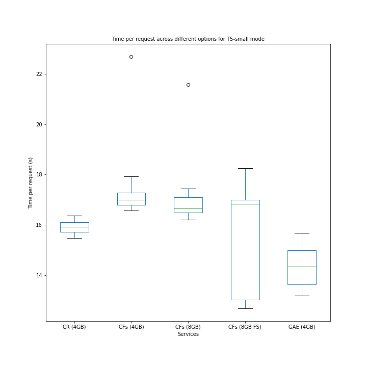

_Figure 6. Latency test for T5-small model deployment_

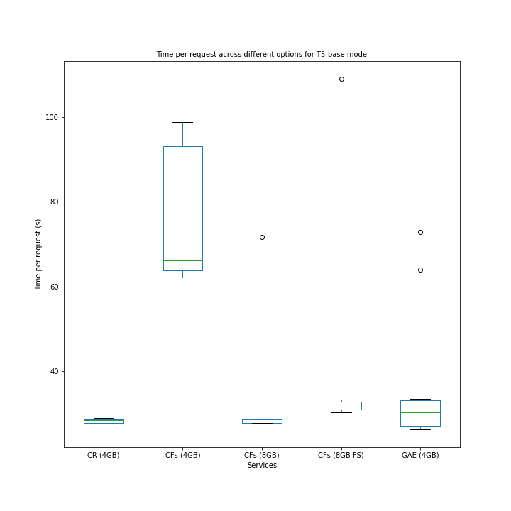

_Figure 7. Latency test for T5-base model deployment (Note: for CFs (4GB) deployment, 5 of the 10 requests failed and we kept only the 5 successful ones for analysis here)_

In this test, we observe that Cloud Run has a low variation in response time, especially for the larger model, 
while Cloud Functions and GAE have high variations and outliers. 
In applications of interest to our team, this kind of predictable response time is highly desirable, 
and although Cloud Functions and GAE do sometimes return a result with lower latency than Cloud Run, their overall performance would tend to make it less desirable.

In terms of speed, it depends on the model size. For the smaller model (T5-small), the GAE deployment
returns results faster than others. However, as the model size increases (T5-small => T5-base), 
Cloud Run becomes slightly faster than other choices.
It is also interesting to see that compared with downloading model files each time a request is made, saving the models to 
the file system of Cloud Function did not speed up the process. Moreover, it did cause a big variation. The reason 
might be because the files saved to the file system of Cloud Function does consume memory and 
the benefit of loading model files directly from the file system was cancelled out by the memory loss.

#### Throughput Tests

Then, we did throughput tests, trying to find the rate at which the requests can be handled. 
Using Python multithreading, we made multiple calls to the deployed T5-small model services simultaneously and 
recorded how many requests can be processed within one minute. 
The results are shown in the figure below.

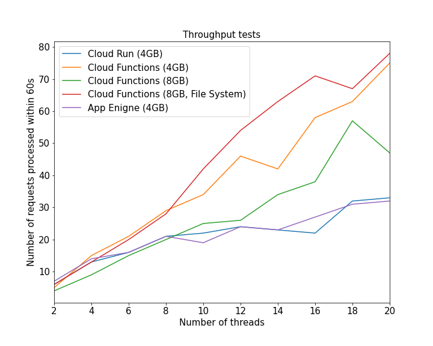

_Figure 8. Throughput test for T5-small deployments_

From the figure, we can see that as we increased the number of threads, the total number of requests processed by the services also increased.
However, Cloud Functions, and especially for Cloud Functions with bigger memories, were able to utilise the increased thread count to process more requests than the other services. Cloud Run and App Engine produced similar results for throughput tests.
The reason for the difference is autoscaling. Due to our configuration, the maximum number of instances for 
App Engine and Cloud Run deployments was set to be 3. However, that cap was not set for Cloud Functions deployments, 
and the deployments scale up automatically to accommodate the increasing number of requests.
Therefore, we saw the number of active instances for Cloud Functions deployment exceeded 20 at the peak in the figure below:

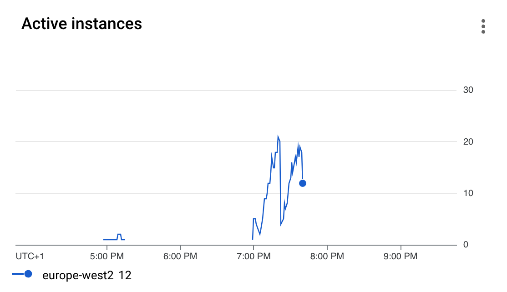

_Figure 9. Autoscaling of a Cloud Functions service_

### Compare Different Configurations of Cloud Run

It is interesting to learn the improvement in throughput and latency in model prediction when the underlying computation resources are getting more powerful. 
We ran the following model prediction experiments using T5-Base on both Cloud Run and App Engine flexible. 
We systematically increased the number of CPU and memory (almost at the same rate of doubling both resources) with the maximum instance fixed to 100. 
We then sent 10 requests sequentially, from which we recorded the minimum, mean and maximum response time.   

With the experiment on App Engine, we can see the response time is reduced as we doubled the resources. However, the rate of increment dropped. 

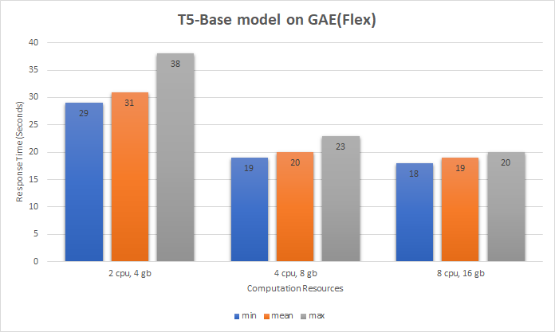

_Figure 10. Comparison of the response time of different configurations of App Engine deployments_


By way of comparison of the difference between the min and max request time, we can see it reduced at the same rate as we increased the CPU and memory. 


For Cloud Run, we saw a similar direction of change in response time compared to App Engine as we added more CPU and memory. 
Because Cloud Run was limited to 4 CPU and 8GB of memory, we could not see the change in response time beyond this.  

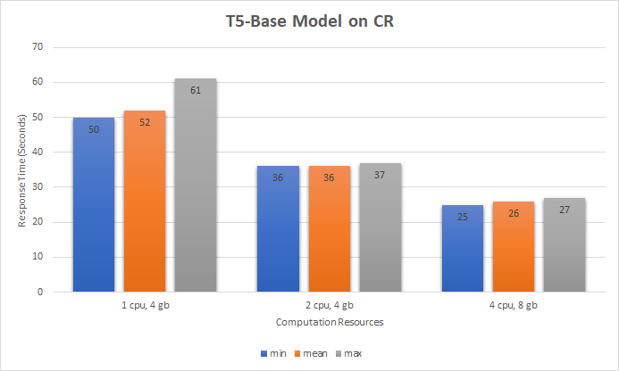

_Figure 11. Comparison of the response time of different configurations of Cloud Run deployments_

The reason that latency of model prediction is not improved at the same rate as the rate of improvement of computation resources in the context of Cloud Run and App Engine is that the bulk of the computation required by transformers-based model prediction happens in matrix multiplications (matmul operations). Both of the hosting environments only provide CPU which does not scale well with parallel data computations. [Dice et al](https://arxiv.org/pdf/2102.06621.pdf) has proposed effective optimisation strategies on matmul operations without the need to change the model implementation, also without affecting the model prediction accuracy either. 

### Reliability Test on Cloud Run 

We conducted reliability tests on Cloud Run by examining the rate of failure in handling incoming model prediction requests. 
The event of making concurrent requests was simulated using multithreading. 
We linearly increased the number of threads from 2 to 20 with an interval of 2, and at each experiment, 
multiple threads simultaneously and continuously sent requests to the Cloud Run instance for a duration of 60 seconds.
Under such loads, the number of failed requests was recorded together with the specific errors encountered.

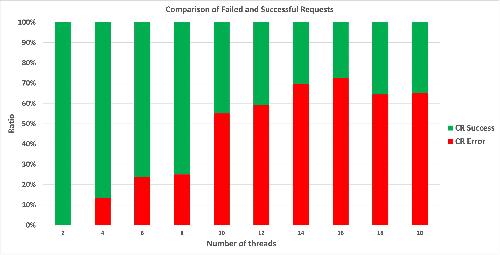

_Figure 12. Comparison of failed and successful requests handled by Cloud Run. Note: the instance
was configured with 4GB of memory, 2 vCPU and 3 as the manual scaling limit_

The reliability test results of serving a T5-small model on a Cloud Run instance is shown in the figure above (for ratios) and the table below (for absolute values). 
It can be seen that, as the number of requests increased, the ratio of successful requests reduced. 
For all the failed requests, as expected, the root cause was that the limit of [maximun number of container instances was reached](https://cloud.google.com/run/docs/troubleshooting#429). 
The error was logged as: `The request was aborted because there was no available instance`


_Table 1. Number of failed and successful requests for different number of threads_ 

| Number of   Threads | 2 | 4  | 6  | 8  | 10 | 12 | 14 | 16 | 18 | 20 |
|---------------------|---|----|----|----|----|----|----|----|----|----|
| CR Error            | 0 | 2  | 5  | 7  | 27 | 35 | 53 | 58 | 58 | 62 |
| CR Success          | 6 | 13 | 16 | 21 | 22 | 24 | 23 | 22 | 32 | 33 |

## Operational Metrics for Monitoring
All the examined serverless services provide handy metrics for monitoring the service performance and 
the metrics available in Cloud Console are listed below:
- Cloud Functions: invocations per second, execution time, memory utilisation, active instances and errors
- Cloud Run: latencies, container instance count, billable container instance time, container memory utilisation
- App Engine: latencies, traffic, VM traffic, CPU utilisation, memory usage, instances, disk bytes

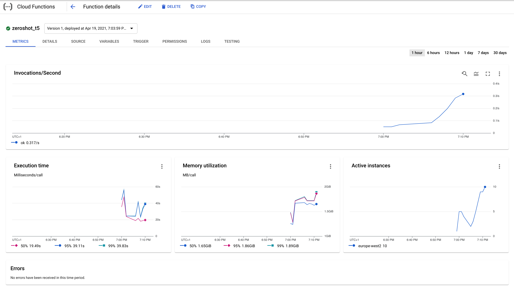

_Figure 13. Cloud Functions monitoring metrics at Cloud Console_

In some charts, different percentiles of metric data distribution were shown, i.e., 50th, 95th and 99th. You have several options to rescale the chart based on time periods, e.g., 1 hour, 6 hours, up to 30 days. 

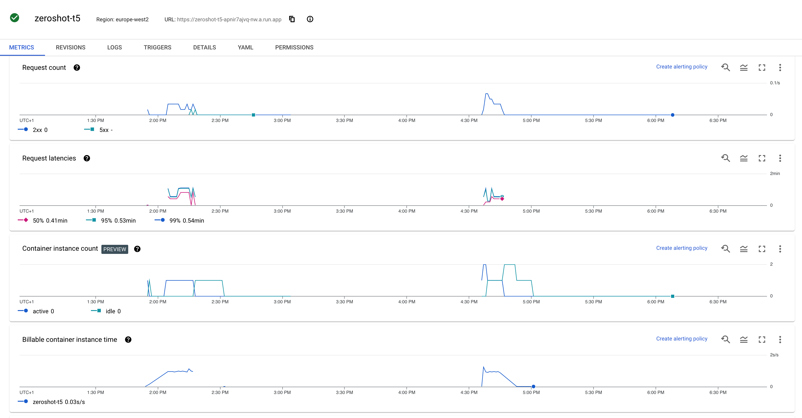

_Figure 14. Cloud Run monitoring metrics at Cloud Console_

Beyond these metrics, you can also find a chart on memory utilisation similar to Cloud Functions above, which captures the container memory utilisation distribution across all container instances of the revision. You can refer to different percentiles of this metric to understand how the utilised instances are performing. 

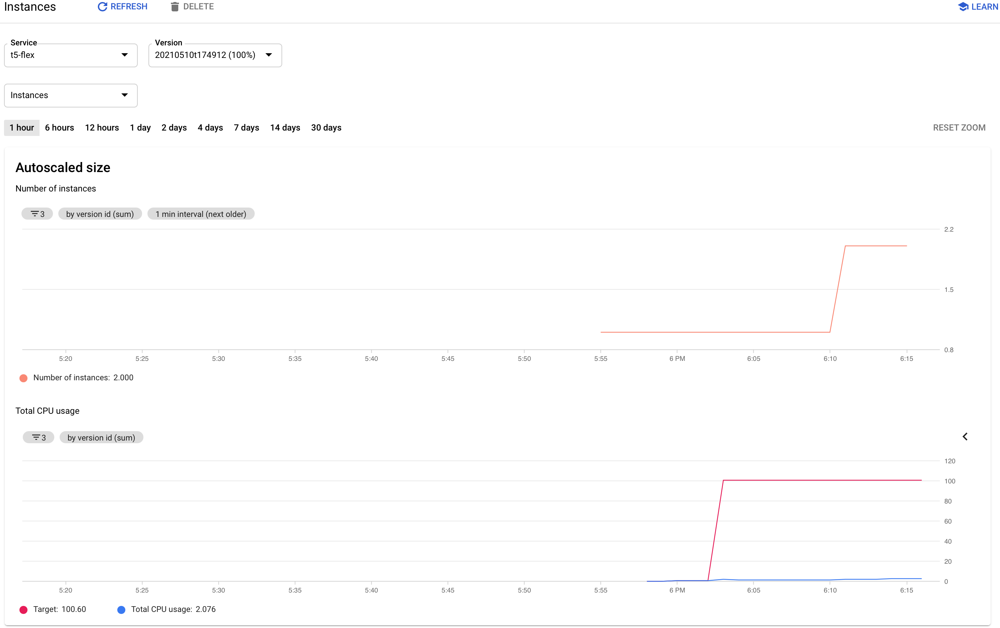

_Figure 15. App Engine monitoring metrics at Cloud Console_

In our experience, Cloud Run and Cloud Functions monitors provide close to real time feeback on the service performance and behaviour while App Engine metrics are generally provided with higher latency making them more suited to post-hoc inspection and review.

## Quotas and Limits

The quotas and limits are usually generous so common needs should be able to be accommodated. 
Here, we only highlight the areas we found to be important:
- Cloud Function
    - resource limits, e.g., the maximum size of a single function cannot exceed 100MB (compressed) for sources or 500MB (uncompressed) for sources plus modules; function memory is no more than 8,192MB
    - time limits, e.g., the maximum execution time for a function is 540s
    -  rate limits
- App Engine
    - flex environment does not enjoy free tier
    - if the application uses additional GCP resources e.g., Cloud Storage, Datastore, Memorystore, their quotas need 
       to be considered
- Cloud Run
    - some resources limits for fully-managed Cloud Run: maximum number of vCPU is 4; maximum memory size per container 
       instance is 8GB; Maximum writable, in-memory filesystem is 8GB; 	Maximum number of concurrent requests is 250
       
The details of quotas and limits for the services can be found at [Cloud Functions](https://cloud.google.com/functions/quotas) 
[App Engine](https://cloud.google.com/appengine/quotas) and [Cloud Run](https://cloud.google.com/run/quotas), respectively.

Be aware that these offers may change at anytime by Google. We recommend you to regularly review the corresponding documentation in different deployment options.


## Our Recommendations

Based on our study and experiments on the deployment options for language models, we provide the following recommendations: 

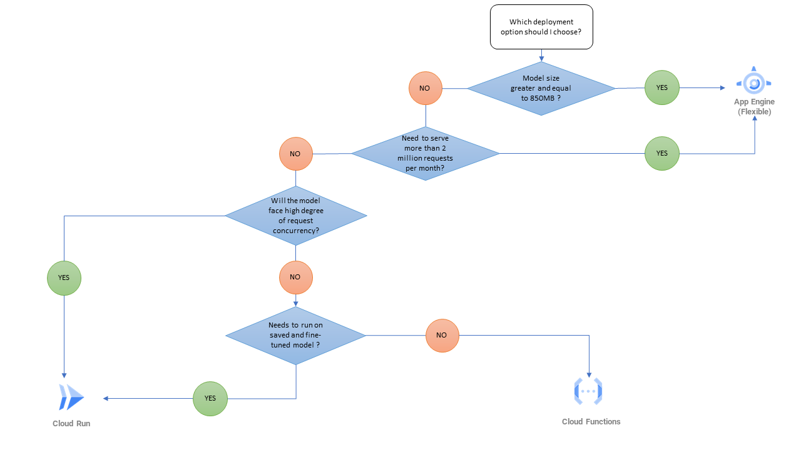
_Figure 16. Model serving recommendation decision tree_

The model deployment should consider three areas: the size of model, concurrency and request handling, and whether the model to be deployed is fine-tuned or pre-trained. The decision about which of these factors should dominate is application specific and based on a business trade off; use of a small yet pre-trained model may save cost and yet the resulting unacceptable model prediction accuracy and performance may create an excessive revenue loss. 

In some projects, nevertheless, all three deployment options discussed in this blog may be used for different kinds of NLP tasks. Here the discussion is based on deploying one model for one type of NLP task.


#### Discussion: Model Size Considerations

Although we have presented some quantitative results for hosting and running language models using different GCP infrastructure components, it's really important to consider the wider world of language models and specifically the fact that some language models can accommodate over 100 million parameters. These parameters need to be placed in the main memory for doing linear algebric operations such as matrix multiplication. Among others, comparing the size of T5-large, T5-3b(XL), T5-11b(XXL) models, they have these sizes: 2.7GB, 10.6GB and 42.1GB respectively. 

Moreover, a transformer's oriented language model may have several layers (e.g. [6 layers used in original Transformers model](https://arxiv.org/pdf/1706.03762v5.pdf), [T5-small has 6 layers, T5-large has 24 layers](https://arxiv.org/pdf/1706.03762v5.pdf)) of the multi-headed attention units and linear feed-forward units. During the process of generating the output text sequence, the intermediate hidden state of the encoding block for each word in the input text sequence needs to be remembered in the memory, and shared with each of the corresponding layers of the decoding block. 

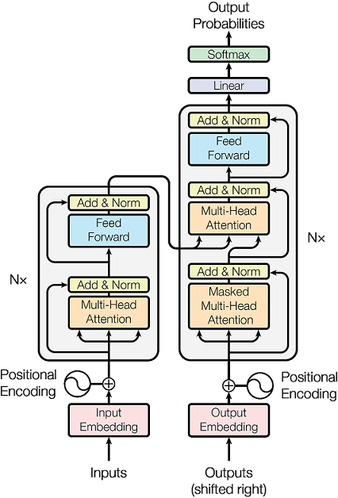

_Figure 17. Architecture of the Transformers model ([source](https://arxiv.org/pdf/1706.03762v5.pdf)) contains the encoder and decoder blocks, each of which contain 6 or 12 layers of encoder or decoder units. Each of the Encoder units contains a set of multi-headed attention units followed by a feedforward unit. Each of the input words in a text sequence will pass through one encoder unit. Each attention unit contains a pre-trained matrix to generate the query, key and value vectors._ 

At the time of writing this blog, Cloud Run offers a maximum limit of 4 vCPU and 8GB of memory. Cloud Functions offers at maximum 8GB of memory. These can cause model prediction to cause memory issues or longer delays in model prediction. By way of comparison, App Engine (Flexible) offers up to 96 CPU and over 600GB of memory([App Engine configuration guide](https://cloud.google.com/appengine/docs/flexible/go/reference/app-yaml#resource-settings)). Therefore, for larger size models, we recommand to use App Engine (Flexible). The reason we choose 850MB of memory as the threhold for making the decision is because during the experiment of t5-large model (2.7GB) on 4CPU/8GB memory of Cloud Run, we sometimes see that the memory limit was violated during continuous processing of 10 incoming requests. The same issue was not witnessed whilst conducting the same experiment on T5base model (850MB) in Cloud Run.    

#### Discussion: Cost Considerations

Both Cloud Run ([pricing](https://cloud.google.com/run/pricing)) and Cloud Functions ([pricing](https://cloud.google.com/functions/pricing#cloud_functions_pricing)) are only run and charged when the requests came in, not during idle time. 
App Engine (Flexible) charges start to incur as soon as the service is deployed and started ([source](https://cloud.google.com/appengine/pricing)). Furthermore, there is no free tier offer in App Engine (Flexible) ([source](https://cloud.google.com/appengine/pricing#flexible-environment-pricing)).
Hence, when a lot of idle time is expected (e.g., not enough requests), Cloud Run and Cloud Functions are more cost-efficient than App Engine ([pricing](https://cloud.google.com/appengine/pricing#flexible-environment-pricing)). 

However, for applications where it is possible to feed a steady workload to App Engine for a long duration, reducing idle time to a minimal level, App Engine can come out as the most-efficient option, 
as shown in the quantitative comparison of the cost of deploying a language model (T5-small) among different options in the Pricing section.  

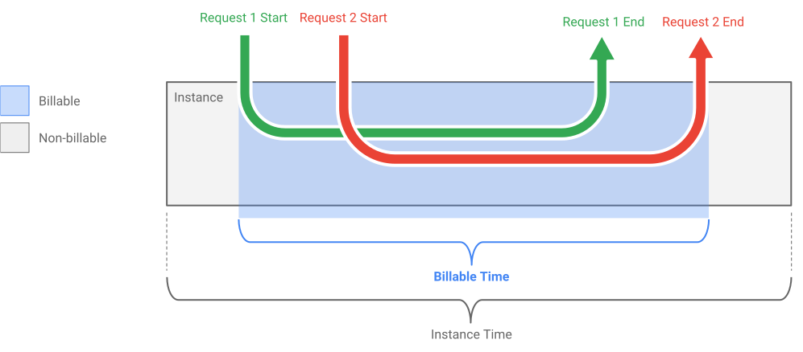

_Figure 18. An illustration of when Cloud Run is billing ([source: Cloud Run pricing](https://cloud.google.com/run/pricing))_


#### Discussion: Pre-trained or Fine-tuned Model Considerations 

Cloud Run allows 8GB of maximum writable in-memory filesystem. The user can use this space to bundle fine-tuned model artefacts. As for Cloud Functions, the maximum size of a single function cannot exceed 100MB (compressed) for sources or 500MB (uncompressed) for sources plus modules. Thus, we suggest the use of Cloud Run to serve model prediction with small fine-tuned models, such as DistilBERT, RoBERTa, T5small or T5base. In some use cases such as for applications that require simple sentiment analysis service, third-party pre-trained models may satisfy the requirement out of the box. If small size pre-trained models such as RoBERTa, [MobileBERT](https://huggingface.co/google/mobilebert-uncased/tree/main) or DistilBERT are found to be appropriate, then Cloud Function can be considered. Furthermore, Cloud Functions' [Free Tier](https://cloud.google.com/functions/pricing#compute_time) offer is attractive: 
- 5GB of engress within free tier, whereas Cloud Run only offers 1GB
- 2 million invocations 
- 400,000 GB-seconds, 200,000 GHz-seconds of compute time (compared to Cloud Run, 180,000 vCPU-seconds, 360,000 GB-seconds free per month)
Many applications may be able to take advantage of this and provide NLP services for free exploiting this mechanism. 

## Conclusions <a id="5"></a>

This blog aims to serve as a reference for deploying BERT and Transformers model specifically on GCP. 
We explored three serverless options, namely Cloud Functions, App Engine (standard environment and flexible environment) 
and Cloud Run for deploying the language models.
The performance and throughput of model deployments were examined and compared both across the services and across different 
configurations for particular options.

From the study, the following conclusions can be drawn:
- Except for the App Engine standard environment, all other options can meet the requirements of serving 
  the selected language models.
- Pricing:
  - Since it does not enjoy the free tier, App Engine flexible environment was the most costly option from the study. 
    However, it might be a good choice, as suggested by Google and our quantitative analysis, for applications that serve traffic continuously. 
  - Cloud Functions and Cloud Run are relatively cost-effective options as they are fully-managed services and 
    users pay only for the resources used. Cloud Functions are most sensitive to the increasing number of invocations, 
    and when the user expects more than 1.34 requests/minute, Cloud Run will be cheaper than Cloud Functions from our observations.
- Performance and throughput:
  - Cloud Run produced the most predictable response time.
  - While Cloud Functions and App Engine deployments responded very quickly for a relatively small model, 
    they were outperformed by Cloud Run as the model size increased.
  - From the throughput tests, we can see the autoscaling ability helped the Cloud Functions to cope with the increasing 
    number of requests very effectively.
  - When the computation capacities of Cloud Run and App Engine deployments increased, we saw an increase in the 
    performance and throughput. However, the improvement did not follow a linear relationship. The reason might be due to 
    the fact that both of the hosting environments only provide CPU which does not scale well with parallel data computations.
- Others:
  - All services provide convenient metrics for monitoring the performance of the deployments.
  - From the authors' experiences, it is much easier to tweak the configurations using Cloud Console for Cloud Run and 
    Cloud Functions compared with App Engine.
    
The work that we have done on the customers' business problems using the new generation of language models has shown us that deployment choices are a critical and complex part of what we need to deliver to build something that is really successful. 
What we have presented in this blog is just a fragment of the picture, 
and there is a tremendous amount of art and experiment that needs to be created covering the options for different application types and on different cloud platforms. 
We are excited to be pushing forward with this work and hope to be able to write further posts on this in the future.


